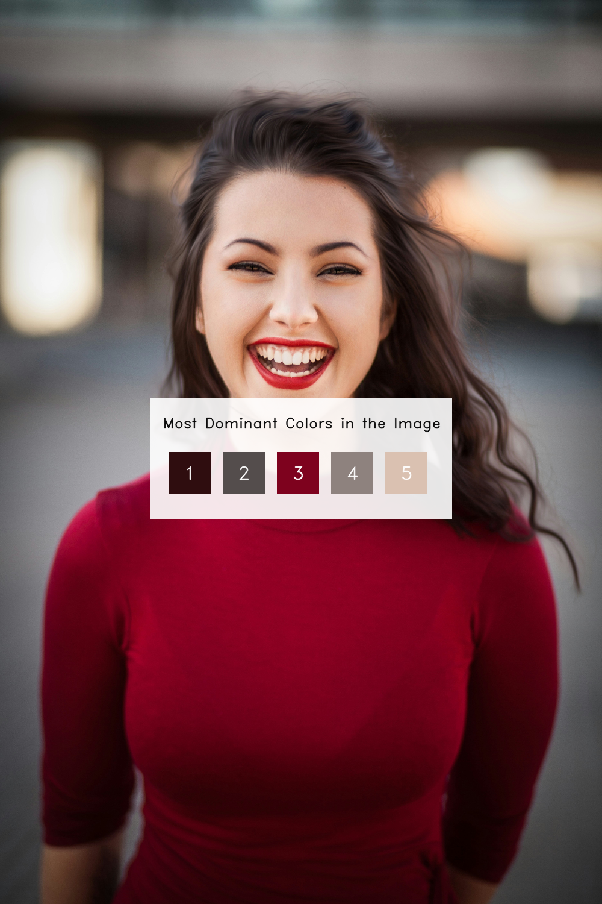
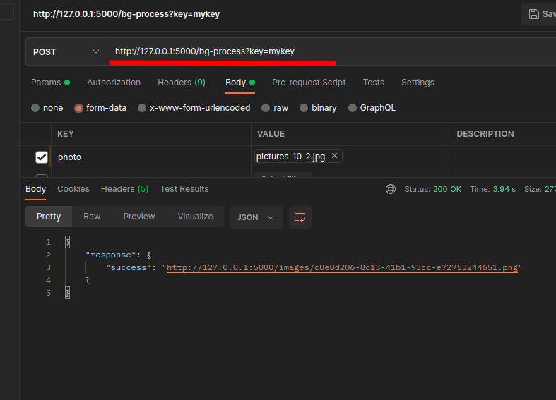

# Flask API for Image Background Removal, Dominant Color Detection, and Image Recognition

This project provides a Flask-based API designed to perform image background removal, dominant color detection, and image recognition. Flask, the rembg package, and the keras image model are used in this project.


## Python Version

This project developed with python 3.10 version

## Run Locally

Clone the project

```bash
  git clone https://github.com/smrussel/image-process-api.git
```

Go to the project directory

```bash
  cd image-process-api/
```

Install dependencies

```bash
  pip install -r requirements.txt
```

Start the server

```bash
  python wsgi.py
```

## For testing Endpoint

An additional Python script, named `api-endpoint-test.py`, is supplied along with some images for testing endpoints using the requests module.

## Additional

Two additional files are supplied: the `endpoint.txt` file contains a list of all the endpoints, and the `api_response_sample.py` file contains a sample of all the responses to the api endpoints.

## Screenshots

### Background Remove

* input image


* output image


### Dominant Color

* input image


* output image


### API test with Postman




## License

[MIT](./LICENSE)


